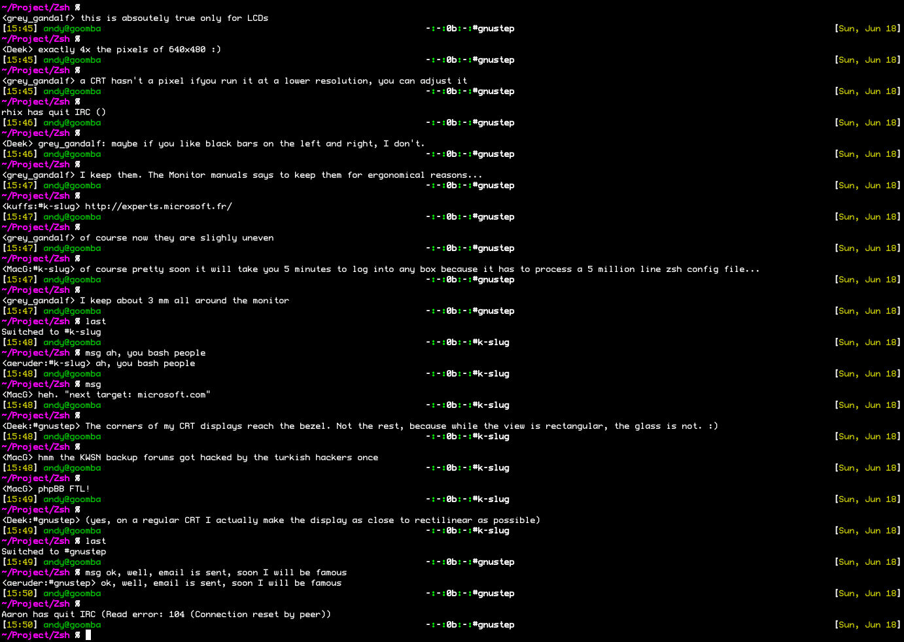

# ZIRC - The 100% Zsh IRC client :)

ZIRC is an IRC client. It hooks into ZLE's asynchronous select() support and
ZSH's builtin TCP support to do everything. Not a *single* external, non-zsh
command was used in this program. If you're typing something at the prompt and
someone messages you, it'll simply interrupt your current prompt, print out the
message and let you continue with your typing.

I suppose if you were in some not too busy channels, this thing could be pretty
useful, but really, its mostly designed to just be a joke so you can tell your
friends:

"Yea, well, my shell has an IRC client"

## Installation

1. Source the file (. ./zirc)

2. (Optional) Run zsh_aliases, this sets up some aliases to make it a bit more comfortable to use.
  * me => zirc_action
  * msg => zirc_msg
  * last => zirc_last
  * connect => zirc_connect
  * etc...

3. Important commands: command(alias)
  * zirc_switch(sw):       change channel focus
  * zirc_last(last):       change channel focus to last place with a message
  * zirc_query(query):     change focus to username
  * zirc_msg(msg):         message to focused user/channel
  * zirc_pmsg(pmsg):       message to any user/channel
  * zirc_quit(quit):       quit with optional quit message
  * zirc_nick(nick):       change nickname
  * zirc_connect(connect): connect to IRC server
  * zirc_part(part):       Leave channel 
  * zirc_help(help):       List zirc commands
  * zirc_action(me):       Perform action in focused channel/user
